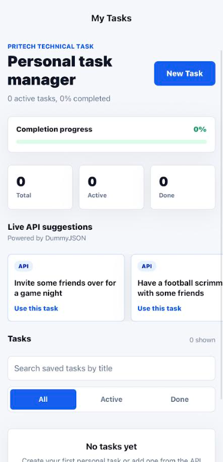
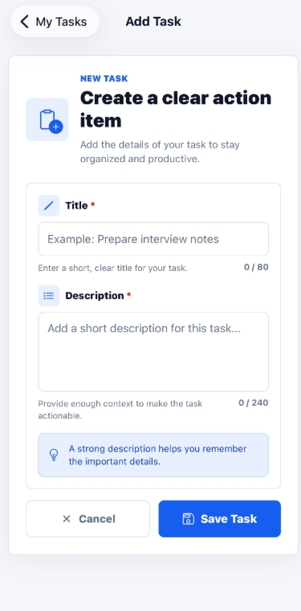
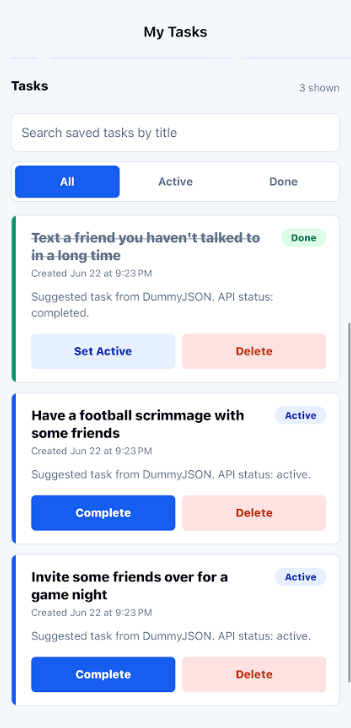

# PRITECH Task Manager

A React Native task manager application built for the PRITECH React Native Technical Challenge.

## Features

- View tasks in a clean task list
- Add new tasks with input validation
- Mark tasks as completed or active
- Delete tasks
- View task details
- Search tasks by title
- Filter tasks by status (All, Active, Done)
- Persist tasks locally using AsyncStorage
- Fetch task suggestions from a public API
- Simple navigation between screens
- Empty state handling

## Tech Stack

- React Native
- Expo SDK 54
- TypeScript
- React Navigation
- AsyncStorage

## Installation

```bash
npm install
npm start
```

Run on Android:

```bash
npm run android
```

Run on iOS (macOS only):

```bash
npm run ios
```

## Public API

Task suggestions are loaded from:

https://jsonplaceholder.typicode.com/todos?_limit=5

## Project Structure

```text
src/
├── api/
├── components/
├── context/
├── screens/
├── storage/
├── theme.ts
└── types.ts
```
## Implemented Functionality

Each task contains:

- Title
- Description
- Status (Active / Completed)
- Created Date

Users can:

- Create tasks
- View task details
- Update task status
- Delete tasks
- Search and filter tasks
- Add suggestions from the API
- Keep tasks stored locally after app restart

## Screenshots

### Home Screen


### Add Task Screen


### Task Details Screen


## Notes

This project was developed as part of the PRITECH React Native Developer Technical Challenge.
